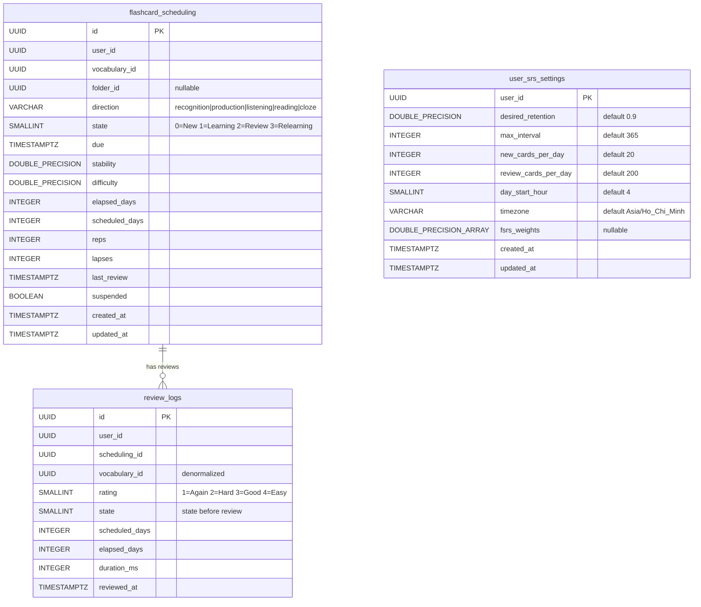
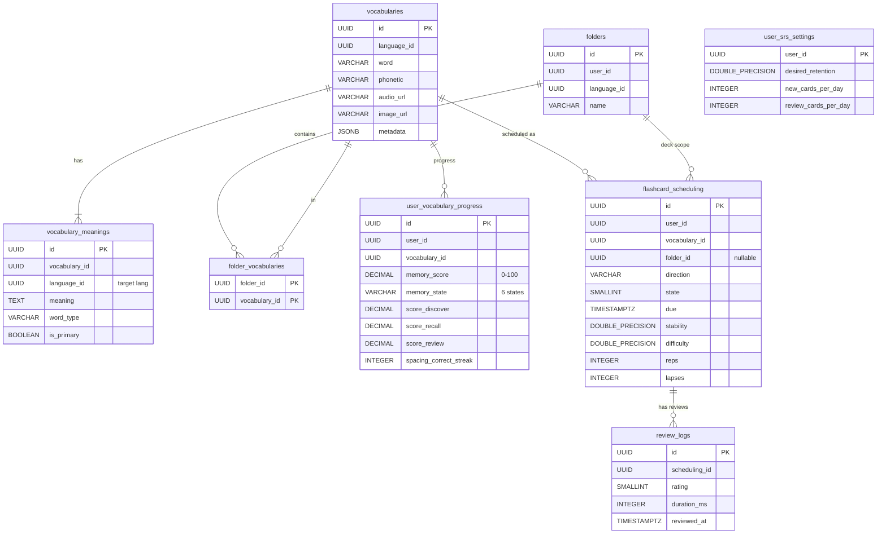

# Flashcard Module — Database Design

> Thiết kế dựa trên research FSRS + phân tích database vocabulary hiện tại.
> Phương án A: Tách `flashcard_scheduling` riêng, giữ `user_vocabulary_progress` cho Memory Score.

---

## Design Principles

1. **Separation of concerns**: Memory Score (gamification/progress) và SRS scheduling (spaced repetition) sống ở 2 bảng khác nhau.
2. **FSRS over SM-2**: Dùng FSRS (go-fsrs library) thay SM-2. Hiệu quả hơn 20-30%, có Go library production-ready.
3. **Uniform direction handling**: Mọi card direction (recognition, production, listening...) xử lý giống nhau trong cùng 1 table.
4. **Reuse existing tables**: `folders` = decks, `vocabularies` = card content. Không tạo lại.
5. **Immutable review logs**: Audit trail cho analytics và FSRS weight training per-user.
6. **No foreign key constraints**: Consistent với vocabulary module — referential integrity ở application layer.

---

## Liên hệ với Vocabulary DB hiện tại

### Tận dụng (không thay đổi)

| Bảng | Vai trò trong Flashcard |
|---|---|
| `vocabularies` | Card content (word, phonetic, audio, image, metadata) |
| `vocabulary_meanings` | Card back content (meanings per target language) |
| `vocabulary_examples` | Card back content (example sentences) |
| `folders` | **Deck** — user-scoped collection of vocabularies |
| `folder_vocabularies` | Deck ↔ Card junction (M:N) |
| `learning_sessions` | Study session tracking (thêm mode `flashcard_review`) |

### Thay đổi

| Bảng | Thay đổi |
|---|---|
| `user_vocabulary_progress` | Xóa SM-2 fields (`easiness_factor`, `interval_days`, `repetitions`, `next_review_at`, `last_reviewed_at`). Chỉ giữ Memory Score + mode scores. SRS scheduling chuyển sang `flashcard_scheduling`. |

### Thêm mới

| Bảng | Mô tả |
|---|---|
| `flashcard_scheduling` | FSRS scheduling per user × vocabulary × direction |
| `review_logs` | Immutable audit trail, 1 row per review action |
| `user_srs_settings` | Per-user FSRS configuration |

---

## Schema

### `flashcard_scheduling` — FSRS scheduling per card direction

1 row per user × vocabulary × direction. Fields map 1:1 với `go-fsrs.Card` struct.

```sql
CREATE TABLE flashcard_scheduling (
    id              UUID PRIMARY KEY,
    user_id         UUID NOT NULL,
    vocabulary_id   UUID NOT NULL,
    folder_id       UUID,                           -- NULL = orphan card (từ proficiency level study)

    -- Card direction (mỗi direction = 1 scheduling riêng)
    direction       VARCHAR(20) NOT NULL DEFAULT 'recognition',
    -- 'recognition' (L2→L1): 你好 → Xin chào         (default, luôn tạo)
    -- 'production'  (L1→L2): Xin chào → 你好           (unlock sau)
    -- 'listening'   (Audio → meaning)                   (khi có audio)
    -- 'reading'     (Word → phonetic): 你好 → nǐ hǎo   (CJK languages)
    -- 'cloze'       (Sentence cloze)                    (nâng cao)

    -- FSRS state (maps 1:1 với go-fsrs Card struct)
    state           SMALLINT NOT NULL DEFAULT 0,    -- 0=New, 1=Learning, 2=Review, 3=Relearning
    due             TIMESTAMPTZ NOT NULL DEFAULT NOW(),
    stability       DOUBLE PRECISION NOT NULL DEFAULT 0,
    difficulty      DOUBLE PRECISION NOT NULL DEFAULT 0,
    elapsed_days    INTEGER NOT NULL DEFAULT 0,
    scheduled_days  INTEGER NOT NULL DEFAULT 0,
    reps            INTEGER NOT NULL DEFAULT 0,
    lapses          INTEGER NOT NULL DEFAULT 0,
    last_review     TIMESTAMPTZ,

    suspended       BOOLEAN NOT NULL DEFAULT false,

    created_at      TIMESTAMPTZ DEFAULT NOW(),
    updated_at      TIMESTAMPTZ DEFAULT NOW(),

    UNIQUE(user_id, vocabulary_id, direction)
);

-- Critical: fetching due cards cho study session
CREATE INDEX idx_fs_due ON flashcard_scheduling(user_id, state, due)
    WHERE suspended = false;

-- Fetching due cards per folder (deck)
CREATE INDEX idx_fs_folder_due ON flashcard_scheduling(user_id, folder_id, state, due)
    WHERE suspended = false;

-- Lookup by vocabulary
CREATE INDEX idx_fs_vocab ON flashcard_scheduling(vocabulary_id);
```

### `review_logs` — Immutable audit trail

1 row per review action. Không bao giờ update/delete. Dùng cho:
- Daily limit counting
- Analytics (accuracy, streaks, heatmap)
- FSRS weight optimization per-user (tương lai)

```sql
CREATE TABLE review_logs (
    id              UUID PRIMARY KEY,
    user_id         UUID NOT NULL,
    scheduling_id   UUID NOT NULL,                 -- FK to flashcard_scheduling
    vocabulary_id   UUID NOT NULL,                 -- denormalized cho analytics

    rating          SMALLINT NOT NULL,             -- 1=Again, 2=Hard, 3=Good, 4=Easy
    state           SMALLINT NOT NULL,             -- state TRƯỚC review
    scheduled_days  INTEGER NOT NULL DEFAULT 0,    -- interval đã schedule
    elapsed_days    INTEGER NOT NULL DEFAULT 0,    -- ngày thực tế từ lần review trước
    duration_ms     INTEGER NOT NULL DEFAULT 0,    -- thời gian user xem card (ms)

    reviewed_at     TIMESTAMPTZ NOT NULL DEFAULT NOW()
);

CREATE INDEX idx_rl_user_date ON review_logs(user_id, reviewed_at DESC);
CREATE INDEX idx_rl_scheduling ON review_logs(scheduling_id, reviewed_at DESC);

-- Daily limit counting: đếm reviews hôm nay per user
CREATE INDEX idx_rl_daily_count ON review_logs(user_id, reviewed_at);
```

> **Volume estimate (50K MAU)**: ~15M rows/month (50K users × 10 reviews/day × 30 days).
> Cân nhắc **table partitioning by month** khi scale.

### `user_srs_settings` — Per-user FSRS configuration

```sql
CREATE TABLE user_srs_settings (
    user_id              UUID PRIMARY KEY,
    desired_retention    DOUBLE PRECISION NOT NULL DEFAULT 0.9,   -- range 0.7 ~ 0.97
    max_interval         INTEGER NOT NULL DEFAULT 365,            -- ngày
    new_cards_per_day    INTEGER NOT NULL DEFAULT 20,
    review_cards_per_day INTEGER NOT NULL DEFAULT 200,
    day_start_hour       SMALLINT NOT NULL DEFAULT 4,             -- 4:00 AM local
    timezone             VARCHAR(50) NOT NULL DEFAULT 'Asia/Ho_Chi_Minh',

    -- FSRS weights (NULL = dùng default parameters từ go-fsrs)
    -- 21 elements cho FSRS-6, có thể train per-user từ review_logs
    fsrs_weights         DOUBLE PRECISION[],

    created_at           TIMESTAMPTZ DEFAULT NOW(),
    updated_at           TIMESTAMPTZ DEFAULT NOW()
);
```

### Thay đổi `user_vocabulary_progress` — Xóa SM-2 fields

```sql
-- SM-2 fields → REMOVED (scheduling đã chuyển sang flashcard_scheduling dùng FSRS)
ALTER TABLE user_vocabulary_progress
    DROP COLUMN easiness_factor,
    DROP COLUMN interval_days,
    DROP COLUMN repetitions,
    DROP COLUMN next_review_at,
    DROP COLUMN last_reviewed_at;

-- user_vocabulary_progress giờ CHỈ chứa:
--   memory_score, memory_state, score_discover, score_recall, score_stroke_guided,
--   score_stroke_recall, score_pinyin_drill, score_ai_chat, score_review,
--   score_mastery_check, spacing_score, spacing_correct_streak, last_mistake_at, max_points
```

---

## ERD

### Flashcard-specific ERD



### Full ERD (Flashcard + Vocabulary liên kết)



---

## Card Direction Flow

### Khi nào tạo card direction nào?

| Direction | Khi nào tạo | Điều kiện |
|---|---|---|
| `recognition` | User thêm vocab vào folder / bắt đầu học | Luôn tạo (default) |
| `production` | Sau khi recognition đạt Review state (reps >= 3) | Auto-unlock hoặc user toggle |
| `listening` | Khi vocabulary có `audio_url` | Auto-tạo cùng recognition |
| `reading` | Khi language config có `has_stroke: true` (CJK) | Auto-tạo cùng recognition |
| `cloze` | Khi vocabulary có examples với cloze markers | Pro feature, user toggle |

### Card content per direction

| Direction | Front | Back |
|---|---|---|
| `recognition` | word + phonetic + audio button | meanings + examples + image |
| `production` | primary meaning + word_type | word + phonetic + audio |
| `listening` | 🔊 audio playback (auto-play) | word + phonetic + meanings |
| `reading` | word (large, no phonetic) | phonetic + meanings |
| `cloze` | example sentence với word blanked | word + full sentence |

---

## go-fsrs Mapping

`flashcard_scheduling` fields map trực tiếp với `go-fsrs.Card`:

```go
// go-fsrs Card struct
type Card struct {
    Due           time.Time  // → flashcard_scheduling.due
    Stability     float64    // → flashcard_scheduling.stability
    Difficulty    float64    // → flashcard_scheduling.difficulty
    ElapsedDays   uint64     // → flashcard_scheduling.elapsed_days
    ScheduledDays uint64     // → flashcard_scheduling.scheduled_days
    Reps          uint64     // → flashcard_scheduling.reps
    Lapses        uint64     // → flashcard_scheduling.lapses
    State         State      // → flashcard_scheduling.state
    LastReview    time.Time  // → flashcard_scheduling.last_review
}

// go-fsrs ReviewLog struct
type ReviewLog struct {
    Rating        Rating     // → review_logs.rating
    ScheduledDays uint64     // → review_logs.scheduled_days
    ElapsedDays   uint64     // → review_logs.elapsed_days
    Review        time.Time  // → review_logs.reviewed_at
    State         State      // → review_logs.state
}
```

---

## Query Patterns

### Fetch due cards cho study session

```sql
-- Lấy cards due cho user, optional filter by folder (deck)
SELECT fs.*, v.word, v.phonetic, v.audio_url, v.image_url, v.metadata
FROM flashcard_scheduling fs
JOIN vocabularies v ON v.id = fs.vocabulary_id
WHERE fs.user_id = $1
  AND fs.suspended = false
  AND (fs.folder_id = $2 OR $2 IS NULL)  -- NULL = all folders
  AND (
    (fs.state IN (1, 3) AND fs.due <= $3)           -- learning + relearning: due now
    OR (fs.state = 2 AND fs.due <= $3)               -- review: due today
    OR (fs.state = 0)                                 -- new cards
  )
ORDER BY
  CASE fs.state
    WHEN 1 THEN 0  -- learning first
    WHEN 3 THEN 1  -- relearning second
    WHEN 2 THEN 2  -- review third
    WHEN 0 THEN 3  -- new last
  END,
  fs.due ASC
LIMIT $4;  -- batch size (e.g. 20)
```

### Count daily reviews (cho daily limit)

```sql
SELECT COUNT(*) FROM review_logs
WHERE user_id = $1
  AND reviewed_at >= $2;  -- day_start (UTC, calculated from user timezone + day_start_hour)
```

### Count cards per state (deck stats)

```sql
SELECT
  COUNT(*) FILTER (WHERE state = 0) AS new_count,
  COUNT(*) FILTER (WHERE state IN (1, 3)) AS learning_count,
  COUNT(*) FILTER (WHERE state = 2 AND due <= NOW()) AS review_due_count,
  COUNT(*) FILTER (WHERE state = 2 AND due > NOW()) AS review_later_count
FROM flashcard_scheduling
WHERE user_id = $1
  AND folder_id = $2
  AND suspended = false;
```

### Review heatmap (GitHub-style)

```sql
SELECT DATE(reviewed_at AT TIME ZONE $2) AS review_date, COUNT(*) AS review_count
FROM review_logs
WHERE user_id = $1
  AND reviewed_at >= $3  -- start of year
GROUP BY review_date
ORDER BY review_date;
```

---

## Sync: flashcard_scheduling ↔ user_vocabulary_progress

Khi user submit review trên flashcard:
1. Update `flashcard_scheduling` với FSRS result
2. Insert `review_logs`
3. Update `user_vocabulary_progress.score_review` (mode score cho Review mode)
4. Recalculate `user_vocabulary_progress.memory_score`

Direction `recognition` review → cập nhật `score_discover` (mode Discover).
Direction khác → cập nhật `score_review` (mode Review).

---

## Volume Estimates (50K MAU)

| Bảng | Rows dự kiến | Growth |
|---|---|---|
| `flashcard_scheduling` | ~5M (50K users × ~100 vocab × 1-2 directions avg) | Slow (grows with user vocabulary) |
| `review_logs` | ~15M/month (50K users × 10 reviews/day × 30 days) | Fast — partition by month |
| `user_srs_settings` | ~50K (1 per user) | Slow |

> `review_logs` là hot table — cân nhắc **table partitioning by month** khi scale.
