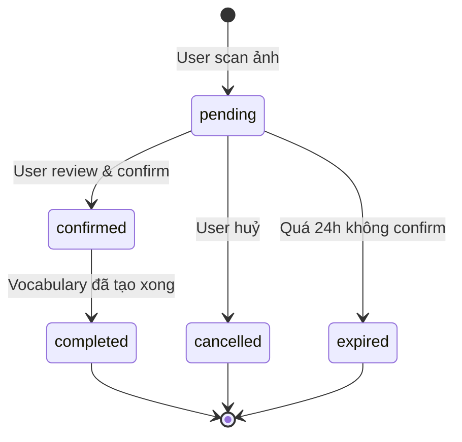
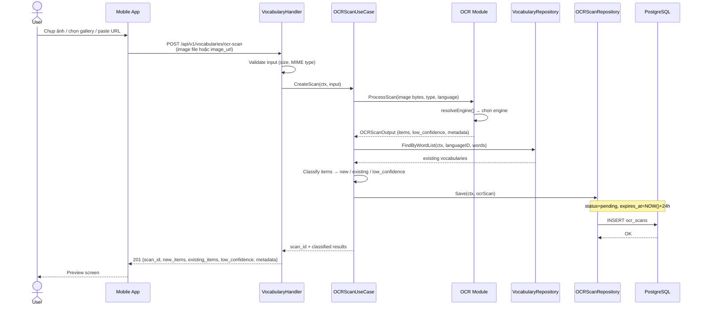
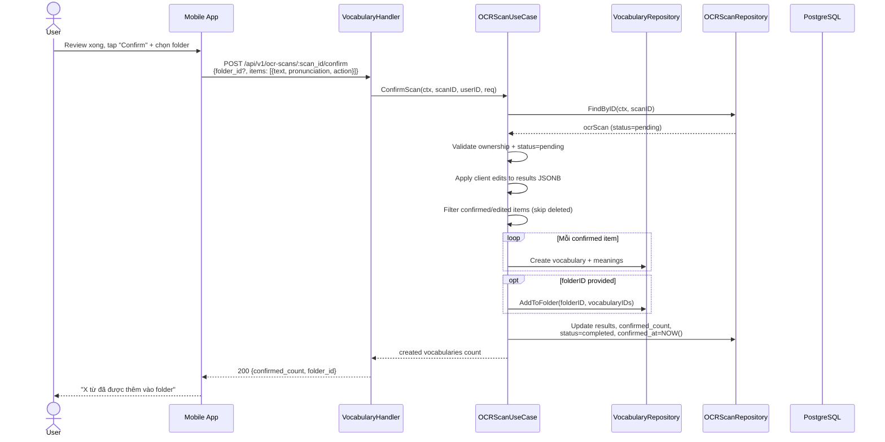
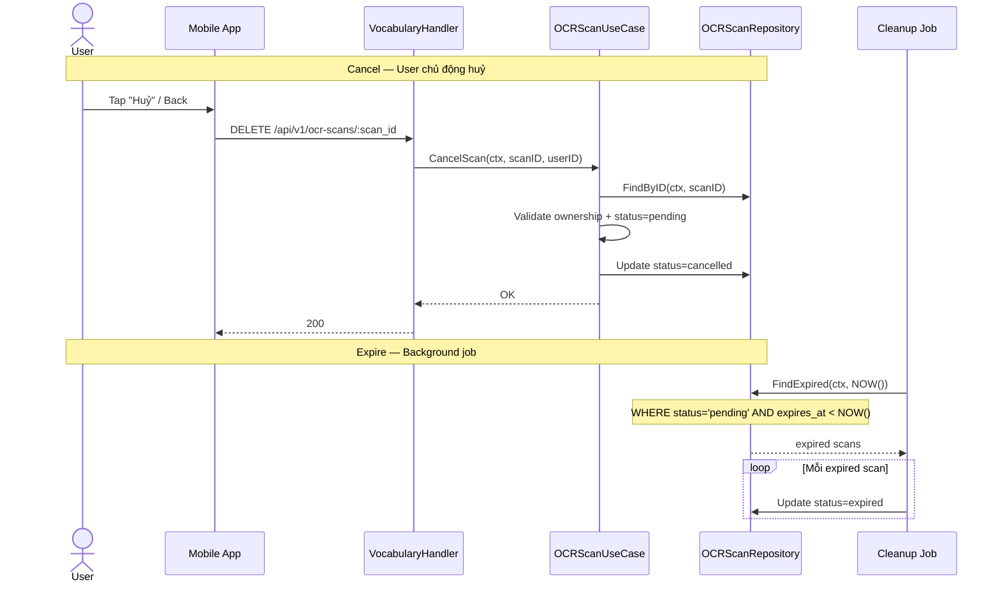
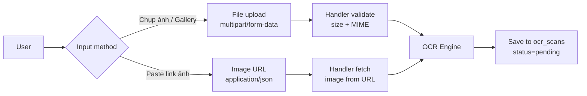

# OCR Scan — Stateful Workflow

> Luồng hoạt động tương ứng với bảng `ocr_scans` trong `database_design.md` Nhóm 6.
> Flow hiện tại là stateless (scan → trả kết quả → xong). Document này mô tả flow stateful cần implement.

---

## Status Workflow

---

## Sequence Diagram — Full Flow

### Phase 1 — Scan & Persist

**Mục đích:** Nhận ảnh từ user, xử lý OCR, phân loại kết quả (từ mới / từ đã có / confidence thấp), lưu vào DB để user review sau.

Phase này là bắt buộc. Không có nó thì không có gì để review.

---

### Phase 2 — Confirm & Create Vocabularies

**Mục đích:** User đã review xong (ở client), gửi danh sách items cuối cùng, server tạo vocabulary từ đó.

Client gửi kèm danh sách items đã review (edited/confirmed/deleted) trong confirm request. Server apply edits + tạo vocabulary trong 1 bước.

---

## Sequence Diagram — Cancel & Expire

---

## API Endpoints (cần implement)

| Method | Endpoint | Mô tả |
|--------|----------|-------|
| `POST` | `/api/v1/vocabularies/ocr-scan` | Phase 1: Scan ảnh → lưu pending → trả results |
| `GET` | `/api/v1/ocr-scans/:id` | Lấy scan + results (re-open preview nếu app bị tắt) |
| `POST` | `/api/v1/ocr-scans/:id/confirm` | Phase 2: Client gửi items đã review → tạo vocabularies |
| `DELETE` | `/api/v1/ocr-scans/:id` | Cancel scan |
| `GET` | `/api/v1/ocr-scans` | List scan history (user_id, paginated) |

---

## Input Methods

| Input | `image_url` trong DB |
|-------|---------------------|
| File upload | S3 URL (nếu đã tích hợp S3) hoặc NULL |
| Image URL | URL gốc user cung cấp |
