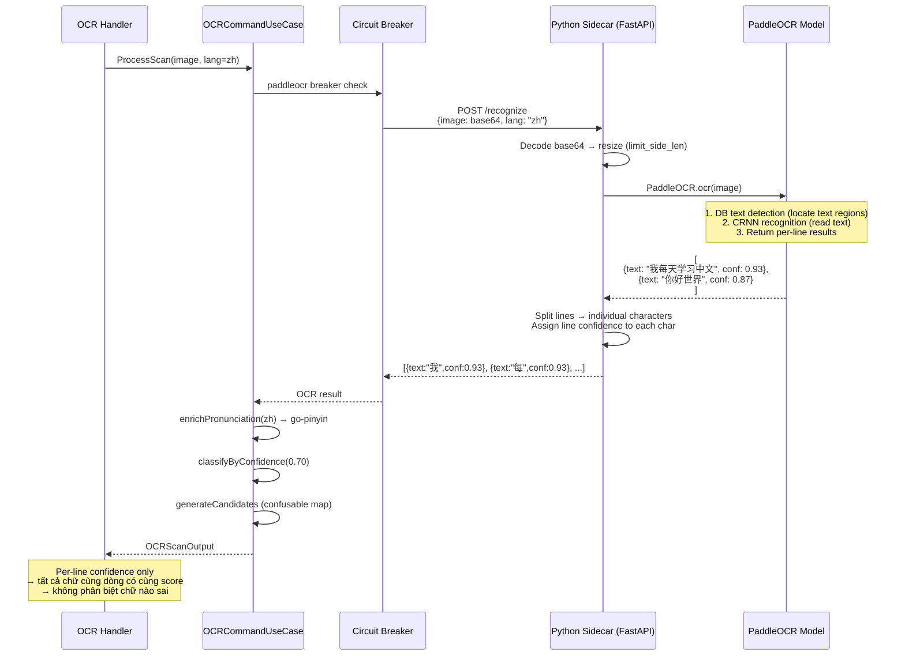
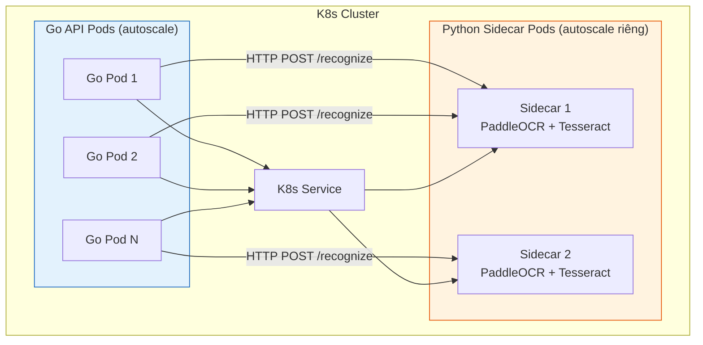

# PaddleOCR — Thách thức & Định hướng

## Vai trò hiện tại

Dev/fallback engine. Production dùng Google Vision (printed) + Baidu (handwritten zh). PaddleOCR chỉ hợp lý làm primary khi > 50K req/ngày (crossover point chi phí).

---

## Thách thức triển khai

### Ops overhead

| Thách thức | Chi tiết |
|-----------|---------|
| Python sidecar | PaddleOCR là Python library → Go backend không gọi trực tiếp. Phải chạy 1 Python service riêng (FastAPI) bên cạnh Go server |
| Deployment phức tạp | K8s cần thêm 1 container/pod cho Python sidecar. Quản lý 2 runtime (Go + Python) |
| Model size | PaddleOCR model ~150-300MB. Container image lớn, cold start chậm |
| Resource | CPU inference chậm (~2-5s/ảnh). GPU inference nhanh (~200ms) nhưng GPU trên K8s đắt |
| Scaling độc lập | Go server scale khác Python sidecar. Sidecar là bottleneck → cần autoscale riêng |
| Health check | Phải monitor 2 service. Sidecar crash → Go server vẫn healthy nhưng OCR chết |

### Per-line confidence only

Đây là hạn chế kỹ thuật lớn nhất:

```
Google Vision:  "学习好" → 学(0.95) 习(0.92) 好(0.88)  ← per-character
PaddleOCR:      "学习好" → confidence: 0.91              ← per-line only
```

- Không biết chữ nào OCR sai → không classify `low_confidence` chính xác
- User thấy "confidence 91%" nhưng 1 trong 3 chữ có thể sai hoàn toàn
- Không đủ granularity cho UX requirement: highlight từng chữ xanh/đỏ

---

## So sánh cơ chế PaddleOCR vs Google Vision

| | Google Cloud Vision | PaddleOCR |
|---|---|---|
| Runtime | Cloud API, managed | Self-hosted Python |
| Giao tiếp | Go SDK → gRPC đến Google server | HTTP POST đến Python sidecar |
| Model | Proprietary, trained trên billions of images | Open-source PP-OCRv5 |
| Detection | DOCUMENT_TEXT_DETECTION → Page → Block → Paragraph → Word → Symbol hierarchy | DB text detection → CRNN recognition → per-line |
| Output granularity | Symbol level (mỗi chữ Hán = 1 symbol + confidence + bounding box) | Line level (1 dòng text + 1 confidence) |
| Language detection | Tự detect mixed content (CN+EN+VN) | Cần chỉ định language, mixed kém hơn |
| Handwritten | Trung bình | Rất tốt (PP-OCRv5 vượt GPT-4o cho handwritten zh) |
| Latency | ~500ms-1.5s (network đến Google) | ~200ms GPU / ~2-5s CPU (local) |
| Cost | $1.50/1K requests | Infra cost (server + GPU) |
| Availability | 99.9% SLA | Tự quản lý uptime |

---

## Sequence Diagram



### Deployment topology



---

## Giao tiếp Go ↔ Python sidecar

### Hiện tại: HTTP REST

```
Go server → POST /recognize (JSON, base64 image) → Python FastAPI → PaddleOCR → response
```

Đủ dùng cho dev/fallback. Bottleneck là OCR inference (2-5s CPU), không phải serialization.

### Khi nào chuyển sang gRPC

Khi PaddleOCR thành primary engine (> 50K req/ngày):

| Yếu tố | Tại sao gRPC lúc đó hợp lý |
|---------|---------------------------|
| Bandwidth | 37% saving trên mỗi request. 50K req × 500KB = tiết kiệm ~9GB/ngày transfer |
| Multiplexing | HTTP/2 — nhiều request trên 1 connection, giảm connection overhead giữa Go pods ↔ Python pods |
| Contract | Proto file là single source of truth — Go client + Python server auto-gen, không lệch DTO |
| Health check | gRPC health check protocol chuẩn — K8s liveness/readiness probe native support |
| Deadline propagation | gRPC deadline tự truyền từ Go → Python — timeout handling nhất quán, không cần tự implement |

---

## Chi phí crossover

| Quy mô | Google Vision | PaddleOCR |
|---|---|---|
| 1K req/ngày | **$43** | ~$124 |
| 10K req/ngày | **$449** | ~$384 |
| 50K req/ngày | $2,249 | **~$768** |
| 100K req/ngày | $4,499 | **~$1,152** |
| 500K req/ngày | $13,499 | **~$3,840** |

< 50K/ngày → cloud APIs rẻ hơn. > 50K/ngày → PaddleOCR self-hosted rẻ nhất.
