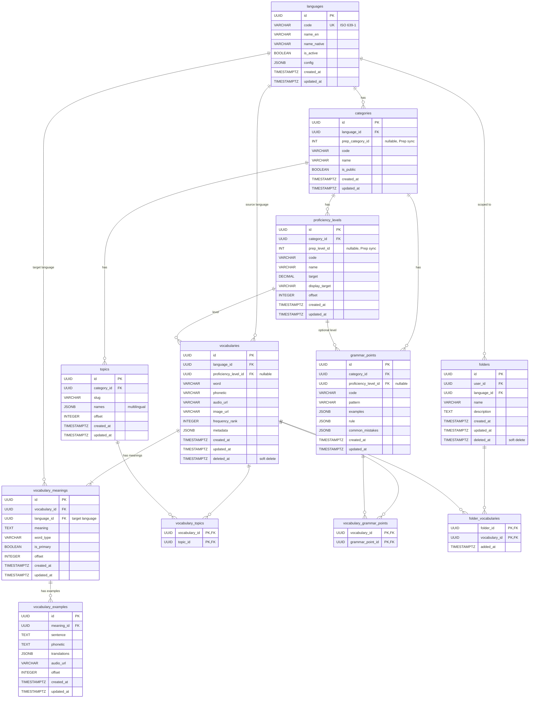
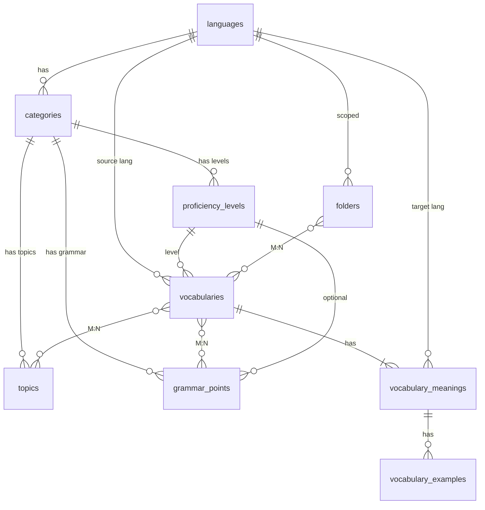

# Vocabulary Module — Database Design (Multi-language)

> Thiết kế từ requirement PRD v3 + module requirement.
> Schema được thiết kế generic để hỗ trợ đa ngôn ngữ (Chinese, Japanese, Korean, Thai, Indonesian...),
> không hardcode logic riêng cho bất kỳ ngôn ngữ nào.

---

## Design Principles

1. **Language-agnostic core**: Bảng `vocabularies` chứa field generic (`word`, `phonetic`). Data đặc thù ngôn ngữ (radicals, stroke, gender, conjugation...) vào `metadata` JSONB.
2. **Pluggable proficiency systems**: HSK (CN), JLPT (JP), TOPIK (KR), CEFR (chung)... đều nằm trong `proficiency_levels` — không hardcode level nào.
3. **N target languages**: Meaning không hardcode `meaning_vi`, `meaning_en`. Dùng bảng `vocabulary_meanings` hỗ trợ N ngôn ngữ dịch.
4. **Language-scoped content**: Topics, grammar points, proficiency levels đều thuộc về 1 `language`. Mỗi ngôn ngữ có topic set riêng, grammar set riêng.
5. **Generic pronunciation scoring**: Không hardcode `initial/final/tone` (Mandarin-specific). Dùng JSONB `dimensions` để mỗi ngôn ngữ define scoring dimensions riêng.
6. **No foreign key constraints**: Không dùng `REFERENCES` / `ON DELETE CASCADE` ở DB level. Referential integrity được đảm bảo ở application layer. Lý do: tránh FK check overhead trên write-heavy tables, đơn giản hoá migration, và phù hợp với horizontal scaling strategy.

---

## Nhóm 1: Language & Proficiency

### `languages` — Ngôn ngữ được hỗ trợ

Bảng top-level. Mọi content đều thuộc về 1 language. Khi mở rộng sang ngôn ngữ mới, chỉ cần thêm 1 row + seed content.

```sql
CREATE TABLE languages (
    id         UUID PRIMARY KEY,
    code       VARCHAR(10) NOT NULL UNIQUE,   -- ISO 639-1: 'zh', 'ja', 'ko', 'th', 'id', 'vi', 'en'
    name_en    VARCHAR(100) NOT NULL,          -- 'Chinese', 'Japanese'
    name_native VARCHAR(100) NOT NULL,         -- '中文', '日本語'
    is_active  BOOLEAN DEFAULT true,
    config     JSONB DEFAULT '{}'::jsonb,
    -- Config per language:
    --   zh: { "has_tones": true, "has_stroke": true, "writing_system": "hanzi", "ocr_supported": true }
    --   ja: { "has_tones": false, "has_stroke": true, "writing_systems": ["kanji","hiragana","katakana"], "ocr_supported": true }
    --   ko: { "has_tones": false, "has_stroke": true, "writing_system": "hangul", "ocr_supported": false }
    --   th: { "has_tones": true, "has_stroke": false, "writing_system": "thai", "ocr_supported": false }
    created_at TIMESTAMPTZ DEFAULT NOW(),
    updated_at TIMESTAMPTZ DEFAULT NOW()
);
```

### `categories` — Nhóm hệ thống trình độ

Mỗi ngôn ngữ có thể có nhiều hệ thống (Chinese: HSK + CEFR). 1 category = 1 hệ thống.

```sql
CREATE TABLE categories (
    id               UUID PRIMARY KEY,
    language_id      UUID NOT NULL,
    prep_category_id INT,                          -- FK to Prep ProductCategoryId (NULL = no Prep mapping)
    code             VARCHAR(20) NOT NULL,          -- 'hsk', 'jlpt', 'topik', 'cefr'
    name             VARCHAR(100) NOT NULL,         -- 'HSK 3.0', 'JLPT', 'CEFR'
    is_public        BOOLEAN NOT NULL DEFAULT false,
    created_at       TIMESTAMPTZ DEFAULT NOW(),
    updated_at       TIMESTAMPTZ DEFAULT NOW(),
    UNIQUE(language_id, code)
);

CREATE INDEX idx_categories_language ON categories(language_id);
CREATE UNIQUE INDEX idx_categories_prep_category ON categories(prep_category_id) WHERE prep_category_id IS NOT NULL;
```

### `proficiency_levels` — Hệ thống trình độ per category

Thay thế `hsk_level` hardcode. Mỗi category chứa nhiều levels: HSK 1-9, JLPT N5-N1, CEFR A1-C2.

```sql
CREATE TABLE proficiency_levels (
    id             UUID PRIMARY KEY,
    category_id    UUID NOT NULL,
    prep_level_id  INT,                           -- FK to Prep level ID (NULL = no Prep mapping)
    code           VARCHAR(20) NOT NULL,           -- 'hsk-1', 'jlpt-n5', 'topik-1', 'cefr-a1'
    name           VARCHAR(100) NOT NULL,           -- 'HSK 1', 'JLPT N5'
    target         DECIMAL(8,2),                    -- điểm mục tiêu (e.g. 180.00 cho HSK 1)
    display_target VARCHAR(255),                    -- hiển thị trên UI ('180 điểm')
    offset         INTEGER NOT NULL,                -- 1, 2, 3... dùng để sắp xếp tăng dần
    created_at     TIMESTAMPTZ DEFAULT NOW(),
    updated_at     TIMESTAMPTZ DEFAULT NOW(),
    UNIQUE(category_id, code)
);

CREATE INDEX idx_pl_category ON proficiency_levels(category_id, offset);
CREATE UNIQUE INDEX idx_pl_prep_level ON proficiency_levels(prep_level_id) WHERE prep_level_id IS NOT NULL;
```

---

## Nhóm 2: Vocabulary Content

### `vocabularies` — Từ vựng (global shared, không thuộc user)

Bảng trung tâm. Field names generic: `word` (không phải `hanzi`), `phonetic` (không phải `pinyin`).
Metadata đặc thù ngôn ngữ vào JSONB `metadata`.

```sql
CREATE TABLE vocabularies (
    id               UUID PRIMARY KEY,
    language_id      UUID NOT NULL,
    proficiency_level_id UUID,                  -- NULL = chưa phân loại / custom word

    -- Generic fields (mọi ngôn ngữ đều có)
    word         VARCHAR(255) NOT NULL,     -- '学习', '勉強', '공부', 'เรียน'
    phonetic     VARCHAR(255),              -- 'xuéxí', 'benkyō', 'gongbu', 'riian'
    audio_url        VARCHAR(500),
    image_url        VARCHAR(500),
    frequency_rank   INTEGER,

    -- Language-specific metadata (JSONB — schema khác nhau per language, e.g. radicals, stroke, tones, writing systems...)
    metadata         JSONB DEFAULT '{}'::jsonb,

    created_at       TIMESTAMPTZ DEFAULT NOW(),
    updated_at       TIMESTAMPTZ DEFAULT NOW(),
    deleted_at       TIMESTAMPTZ
);

CREATE UNIQUE INDEX idx_vocab_word_lang ON vocabularies(language_id, word) WHERE deleted_at IS NULL;
CREATE INDEX idx_vocab_language ON vocabularies(language_id);
CREATE INDEX idx_vocab_proficiency ON vocabularies(proficiency_level_id);
CREATE INDEX idx_vocab_deleted_at ON vocabularies(deleted_at);
CREATE INDEX idx_vocab_frequency ON vocabularies(frequency_rank) WHERE frequency_rank IS NOT NULL;
CREATE INDEX idx_vocab_metadata ON vocabularies USING GIN (metadata);
```

### `vocabulary_meanings` — Nghĩa của từ theo N ngôn ngữ đích

Thay thế `meaning_vi`, `meaning_en` hardcode. Hỗ trợ N target languages.
1 từ có thể có nhiều nghĩa trong cùng 1 ngôn ngữ đích (polysemy).

```sql
CREATE TABLE vocabulary_meanings (
    id              UUID PRIMARY KEY,
    vocabulary_id   UUID NOT NULL,
    language_id     UUID NOT NULL,  -- ngôn ngữ đích (vi, en, th...)
    meaning         TEXT NOT NULL,            -- 'học tập', 'to study'
    word_type       VARCHAR(20),              -- 'noun', 'verb', 'adjective', 'adverb', 'phrase'
    is_primary      BOOLEAN DEFAULT false,    -- nghĩa chính
    offset      INTEGER DEFAULT 0,
    created_at      TIMESTAMPTZ DEFAULT NOW(),
    updated_at      TIMESTAMPTZ DEFAULT NOW(),
    UNIQUE(vocabulary_id, language_id, offset)
);

CREATE INDEX idx_vm_vocab ON vocabulary_meanings(vocabulary_id);
CREATE INDEX idx_vm_lang ON vocabulary_meanings(vocabulary_id, language_id);
```

### `vocabulary_examples` — Câu ví dụ cho nghĩa từ vựng

Mỗi nghĩa có thể có nhiều câu ví dụ. Translations hỗ trợ N ngôn ngữ đích qua JSONB.

```sql
CREATE TABLE vocabulary_examples (
    id              UUID PRIMARY KEY,
    meaning_id      UUID NOT NULL,              -- FK to vocabulary_meanings
    sentence        TEXT NOT NULL,              -- '我每天学习中文。'
    phonetic        TEXT,                       -- 'Wǒ měitiān xuéxí zhōngwén.'
    translations    JSONB DEFAULT '{}'::jsonb,  -- { "vi": "Tôi học tiếng Trung mỗi ngày.", "en": "I study Chinese every day." }
    audio_url       VARCHAR(500),
    offset          INTEGER DEFAULT 0,
    created_at      TIMESTAMPTZ DEFAULT NOW(),
    updated_at      TIMESTAMPTZ DEFAULT NOW()
);

CREATE INDEX idx_ve_meaning ON vocabulary_examples(meaning_id);
```

### Ví dụ: Lưu từ "学习" (Chinese → Vietnamese + English)

**Giả sử languages:**

| id | code | name_en |
|---|---|---|
| `L1` | zh | Chinese |
| `L2` | vi | Vietnamese |
| `L3` | en | English |

**`vocabularies`** — 1 row:

| id | language_id | proficiency_level_id | word | phonetic | metadata |
|---|---|---|---|---|---|
| V1 | L1 (zh) | PL1 (HSK 1) | 学习 | xuéxí | `{}` |

**`vocabulary_meanings`** — 4 rows (2 nghĩa × 2 ngôn ngữ đích):

| id | vocabulary_id | language_id | meaning | word_type | is_primary | offset |
|---|---|---|---|---|---|---|
| M1 | V1 | L2 (vi) | học tập | verb | true | 0 |
| M2 | V1 | L2 (vi) | sự học hành | noun | false | 1 |
| M3 | V1 | L3 (en) | to study | verb | true | 0 |
| M4 | V1 | L3 (en) | learning | noun | false | 1 |

**`vocabulary_examples`** — 2 rows (1 câu per meaning chính):

| id | meaning_id | sentence | phonetic | translations |
|---|---|---|---|---|
| E1 | M1 (vi: học tập) | 我每天学习中文。 | Wǒ měitiān xuéxí zhōngwén. | `{"vi":"Tôi học tiếng Trung mỗi ngày.","en":"I study Chinese every day."}` |
| E2 | M3 (en: to study) | 他在图书馆学习。 | Tā zài túshūguǎn xuéxí. | `{"vi":"Anh ấy học ở thư viện.","en":"He studies at the library."}` |

> **Query flow** (user Việt Nam, `lang=vi`):
> 1. `vocabularies WHERE id = V1` → word, phonetic, metadata
> 2. `vocabulary_meanings WHERE vocabulary_id = V1 AND language_id = L2` → M1, M2
> 3. `vocabulary_examples WHERE meaning_id IN (M1, M2)` → E1
> 4. Response trả `translations.vi` từ JSONB, bỏ qua các ngôn ngữ khác

---

## Nhóm 3: Classification

### `topics` — Chủ đề per category

Mỗi category có topic set riêng (HSK có 10 topics, TOEIC có Business/Finance/Travel..., IELTS có Academic/Environment...).
Tên topic hỗ trợ đa ngôn ngữ UI qua JSONB `names`.

```sql
CREATE TABLE topics (
    id          UUID PRIMARY KEY,
    category_id UUID NOT NULL,
    slug        VARCHAR(100) NOT NULL,
    names       JSONB NOT NULL,
    -- { "en": "Daily Life", "vi": "Cuộc sống hằng ngày", "zh": "日常生活" }
    offset  INTEGER NOT NULL DEFAULT 0,
    created_at  TIMESTAMPTZ DEFAULT NOW(),
    updated_at  TIMESTAMPTZ DEFAULT NOW(),
    UNIQUE(category_id, slug)
);

CREATE INDEX idx_topics_category ON topics(category_id);
```

### `vocabulary_topics` — Junction: vocabulary ↔ topic (M:N)

1 từ thuộc nhiều topic (polysemy).

```sql
CREATE TABLE vocabulary_topics (
    vocabulary_id UUID NOT NULL,
    topic_id      UUID NOT NULL,
    PRIMARY KEY (vocabulary_id, topic_id)
);

CREATE INDEX idx_vt_topic ON vocabulary_topics(topic_id);
```

### `grammar_points` — Grammar patterns per category

Mỗi category có grammar set riêng (HSK grammar khác TOEIC grammar). Gắn vào proficiency level (optional).
Example và rule hỗ trợ đa ngôn ngữ qua JSONB.

```sql
CREATE TABLE grammar_points (
    id                   UUID PRIMARY KEY,
    category_id          UUID NOT NULL,
    proficiency_level_id UUID,                          -- NULL = chưa phân loại level
    code                 VARCHAR(50) NOT NULL,
    pattern              VARCHAR(255) NOT NULL,          -- 'S + 把 + O + V + Complement'
    examples             JSONB DEFAULT '{}'::jsonb,
    -- { "source": "我把书放在桌子上。", "translations": { "vi": "Tôi để sách lên bàn.", "en": "..." } }
    rule                 JSONB DEFAULT '{}'::jsonb,
    -- { "vi": "Dùng 把 khi tác động lên đối tượng cụ thể", "en": "Use 把 when..." }
    common_mistakes      JSONB DEFAULT '{}'::jsonb,
    -- { "vi": "Không dùng 把 với 是, 有, 知道", "en": "Don't use 把 with 是, 有, 知道" }
    created_at           TIMESTAMPTZ DEFAULT NOW(),
    updated_at           TIMESTAMPTZ DEFAULT NOW(),
    UNIQUE(category_id, code)
);

CREATE INDEX idx_gp_category ON grammar_points(category_id);
CREATE INDEX idx_gp_proficiency ON grammar_points(proficiency_level_id);
```

### `vocabulary_grammar_points` — Junction: vocabulary ↔ grammar point (M:N)

```sql
CREATE TABLE vocabulary_grammar_points (
    vocabulary_id    UUID NOT NULL,
    grammar_point_id UUID NOT NULL,
    PRIMARY KEY (vocabulary_id, grammar_point_id)
);

CREATE INDEX idx_vgp_gp ON vocabulary_grammar_points(grammar_point_id);
```

---

## Nhóm 4: User Organization

### `folders` — Folder user tự tạo

User-scoped. Scoped per language (1 folder chứa từ của 1 ngôn ngữ).

```sql
CREATE TABLE folders (
    id          UUID PRIMARY KEY,
    user_id     UUID NOT NULL,
    language_id UUID NOT NULL,
    name        VARCHAR(255) NOT NULL,
    description TEXT,
    created_at  TIMESTAMPTZ DEFAULT NOW(),
    updated_at  TIMESTAMPTZ DEFAULT NOW(),
    deleted_at  TIMESTAMPTZ
);

CREATE INDEX idx_folders_user ON folders(user_id, language_id);
CREATE INDEX idx_folders_deleted ON folders(deleted_at);
```

### `folder_vocabularies` — Junction: folder ↔ vocabulary (M:N)

```sql
CREATE TABLE folder_vocabularies (
    folder_id     UUID NOT NULL,
    vocabulary_id UUID NOT NULL,
    added_at      TIMESTAMPTZ DEFAULT NOW(),
    PRIMARY KEY (folder_id, vocabulary_id)
);

CREATE INDEX idx_fv_vocabulary ON folder_vocabularies(vocabulary_id);
```

---

## ERD

### Full Database ERD



### Simplified ERD



## Tổng hợp: Thay đổi so với bản Chinese-only

| Bảng | Thay đổi |
|---|---|
| **MỚI `languages`** | Bảng top-level, mọi content thuộc về 1 language |
| **MỚI `proficiency_levels`** | Thay `hsk_level` INT. Hỗ trợ HSK, JLPT, TOPIK, CEFR... |
| **MỚI `vocabulary_meanings`** | Thay `meaning_vi`/`meaning_en` hardcode. N target languages |
| `vocabularies` | `hanzi`→`word`, `pinyin`→`phonetic`, thêm `language_id`, `proficiency_level_id`. CJK-specific fields (radicals, stroke...) → `metadata` JSONB |
| `topics` | Thêm `language_id`. `name_cn/vi/en` → `names` JSONB |
| `grammar_points` | Thêm `language_id`, `proficiency_level_id`. `example_cn/vi` → `examples` JSONB, `rule` → JSONB, `common_mistake` → `common_mistakes` JSONB |
| `folders` | Thêm `language_id` (1 folder = 1 ngôn ngữ) |
| `learning_sessions` | Thêm `language_id` |
| `pronunciation_scores` | `syllable_*` → `unit_*`. `initial/final/tone_score` → `dimensions` JSONB |
| `ocr_scans` | Thêm `language_id` |
| `user_vocabulary_progress` | Không đổi structure — mode scores giữ nguyên, modes không áp dụng cho ngôn ngữ đó thì giữ 0 |

## Multi-language Expansion Checklist

Khi thêm 1 ngôn ngữ mới:

1. Insert row vào `languages` (code, name, config JSONB)
2. Insert rows vào `proficiency_levels` (JLPT N5-N1, TOPIK 1-6...)
3. Seed `topics` cho ngôn ngữ đó
4. Seed `grammar_points` cho ngôn ngữ đó
5. Import `vocabularies` + `vocabulary_meanings` cho ngôn ngữ đó
6. Config `languages.config` JSONB để enable/disable features (OCR, stroke, tones...)

Không cần migration, không cần code change cho core logic.

## Volume Estimates (50K MAU)

| Nhóm | Bảng | Rows dự kiến |
|---|---|---|
| **Config** | `languages`, `proficiency_levels` | ~5 languages, ~30 levels |
| **Content** | `vocabularies`, `vocabulary_meanings`, `vocabulary_examples`, `topics`, `grammar_points` | ~20K vocab, ~40K meanings, ~50K examples, ~50 topics, ~200 grammar |
| **Organization** | `folders`, `folder_vocabularies` | ~250K folders, ~2.5M links |
| **Learning** | `user_vocabulary_progress` | ~5M |
| **Sessions** | `learning_sessions` | ~1.5M sessions/month |
| **Pronunciation** | `pronunciation_scores` | ~15M/month |
| **Gating** | `user_daily_counters`, `ocr_scans` | ~1.5M counters/month |

> `pronunciation_scores` là hot table — cân nhắc **table partitioning by month** khi scale.

---

## Nhóm 6: OCR & Rate Limiting (chưa implement)

### `ocr_scans` — OCR scan history

Stateful workflow: scan → pending (chờ user review) → confirmed → completed (vocabulary đã tạo).
Hỗ trợ 2 input: file upload (upload S3 → lưu URL) và image URL (lưu trực tiếp).

```sql
CREATE TABLE ocr_scans (
    id              UUID PRIMARY KEY,
    user_id         UUID NOT NULL,
    language_id     UUID NOT NULL,

    -- Image source: S3 URL (upload) hoặc external URL. NULL nếu chưa tích hợp S3.
    image_url       VARCHAR(500),

    -- OCR metadata
    engine     VARCHAR(30) NOT NULL,
    scan_type       VARCHAR(20) NOT NULL DEFAULT 'auto',  -- 'printed' | 'handwritten' | 'auto'
    processing_ms   INTEGER NOT NULL DEFAULT 0,

    -- Denormalized counts (cập nhật khi user confirm)
    detected_count       INTEGER NOT NULL DEFAULT 0,
    new_count            INTEGER NOT NULL DEFAULT 0,
    existing_count       INTEGER NOT NULL DEFAULT 0,
    low_confidence_count INTEGER NOT NULL DEFAULT 0,
    confirmed_count      INTEGER NOT NULL DEFAULT 0,

    -- Kết quả scan + trạng thái review từng item
    results         JSONB NOT NULL DEFAULT '[]'::jsonb,

    -- Organization
    folder_id       UUID,

    -- Workflow: pending → confirmed → completed | cancelled | expired
    status          VARCHAR(20) NOT NULL DEFAULT 'pending',
    confirmed_at    TIMESTAMPTZ,
    expires_at      TIMESTAMPTZ,           -- auto-expire pending scans sau 24h

    created_at      TIMESTAMPTZ DEFAULT NOW(),
    updated_at      TIMESTAMPTZ DEFAULT NOW()
);

CREATE INDEX idx_ocr_scans_user_date ON ocr_scans(user_id, created_at DESC);
CREATE INDEX idx_ocr_scans_user_status ON ocr_scans(user_id, status) WHERE status = 'pending';
CREATE INDEX idx_ocr_scans_expires ON ocr_scans(expires_at) WHERE status = 'pending';
```

Rate limiting / quota được thiết kế riêng trong `.claude/docs/01-backend/phase-1-vocabulary/vocabulary/entitlement/`.

---

## Nhóm 5: Learning Progress

> **Chưa review.** Schema dưới đây là bản draft từ requirement, chưa được review về quan hệ entity, scalability, và sync strategy. Cần review kỹ trước khi implement.

### `user_vocabulary_progress` — Memory Score + SRS per user per word

Bảng cốt lõi cho Trụ 2 + 3. Lưu toàn bộ tiến độ học của 1 user với 1 từ:

- **Memory Score** tổng hợp từ 8 mode: `Σ(Mode_Score × Weight) + Spacing_Score / Max_Points × 100`
- **6 trạng thái**: Start Learning → Still Learning → Almost Learnt → Finish Learning → Memory Mode → Mastered
- **SM-2 data** cho spaced repetition
- **Spacing streak** cho điều kiện Memory Mode (≥1) và Mastered (≥2)
- `max_points` để handle Free→Pro migration (normalize score)

```sql
CREATE TABLE user_vocabulary_progress (
    id              UUID PRIMARY KEY,
    user_id         UUID NOT NULL,
    vocabulary_id   UUID NOT NULL,

    -- Memory Score (0-100)
    memory_score    DECIMAL(5,2) NOT NULL DEFAULT 0,
    memory_state    VARCHAR(30) NOT NULL DEFAULT 'start_learning',
    -- start_learning, still_learning, almost_learnt,
    -- finish_learning, memory_mode, mastered

    -- Per-mode scores — generic, áp dụng cho mọi ngôn ngữ
    -- Modes nào ngôn ngữ không hỗ trợ thì giữ 0 (e.g. Thai không có stroke mode)
    score_discover       DECIMAL(3,1) DEFAULT 0,  -- max 1, weight 1
    score_recall         DECIMAL(3,1) DEFAULT 0,  -- max 2, weight 2
    score_stroke_guided  DECIMAL(3,1) DEFAULT 0,  -- max 1, weight 1 (CJK only)
    score_stroke_recall  DECIMAL(3,1) DEFAULT 0,  -- max 2, weight 2 (CJK only)
    score_pinyin_drill   DECIMAL(3,1) DEFAULT 0,  -- max 1, weight 1 (pronunciation drill)
    score_ai_chat        DECIMAL(3,1) DEFAULT 0,  -- max 2, weight 2
    score_review         DECIMAL(3,1) DEFAULT 0,  -- max 2, weight 2
    score_mastery_check  DECIMAL(3,1) DEFAULT 0,  -- max 2, weight 2
    spacing_score        DECIMAL(3,1) DEFAULT 0,  -- max 2

    -- SM-2 fields
    easiness_factor  DECIMAL(4,2) NOT NULL DEFAULT 2.50,
    interval_days    INTEGER NOT NULL DEFAULT 1,
    repetitions      INTEGER NOT NULL DEFAULT 0,
    next_review_at   TIMESTAMPTZ,
    last_reviewed_at TIMESTAMPTZ,

    -- Mastered conditions
    spacing_correct_streak INTEGER DEFAULT 0,
    last_mistake_at        TIMESTAMPTZ,

    -- Tier affects max_points: Free vs Pro (varies per language config)
    max_points       INTEGER NOT NULL DEFAULT 11,

    created_at TIMESTAMPTZ DEFAULT NOW(),
    updated_at TIMESTAMPTZ DEFAULT NOW(),

    UNIQUE(user_id, vocabulary_id)
);

CREATE INDEX idx_uvp_user ON user_vocabulary_progress(user_id);
CREATE INDEX idx_uvp_review ON user_vocabulary_progress(user_id, next_review_at)
    WHERE next_review_at IS NOT NULL;
CREATE INDEX idx_uvp_state ON user_vocabulary_progress(user_id, memory_state);
```

### `learning_sessions` — Session tracking

```sql
CREATE TABLE learning_sessions (
    id             UUID PRIMARY KEY,
    user_id        UUID NOT NULL,
    language_id    UUID NOT NULL,
    mode           VARCHAR(30) NOT NULL,
    folder_id      UUID,

    total_words    INTEGER DEFAULT 0,
    correct_words  INTEGER DEFAULT 0,
    duration_ms    INTEGER DEFAULT 0,
    xp_earned      INTEGER DEFAULT 0,

    started_at     TIMESTAMPTZ DEFAULT NOW(),
    completed_at   TIMESTAMPTZ
);

CREATE INDEX idx_ls_user ON learning_sessions(user_id, started_at DESC);
CREATE INDEX idx_ls_language ON learning_sessions(user_id, language_id);
```

### `pronunciation_scores` — Pronunciation tracking per unit

Mỗi ngôn ngữ có đơn vị phát âm khác nhau: syllable (CN), mora (JP), syllable (KR/TH).
Scoring dimensions cũng khác: Chinese có initial/final/tone, Japanese có pitch accent, Thai có tone class...
→ Dùng JSONB `dimensions` thay vì hardcode columns.

```sql
CREATE TABLE pronunciation_scores (
    id                UUID PRIMARY KEY,
    user_id           UUID NOT NULL,
    vocabulary_id     UUID NOT NULL,
    session_id        UUID,

    unit_index        SMALLINT NOT NULL,         -- 0-based, vị trí đơn vị phát âm trong word
    unit_text         VARCHAR(50) NOT NULL,       -- 'xué', 'べん', '공'
    overall_score     SMALLINT,                   -- 0-100

    -- Language-specific scoring dimensions
    dimensions        JSONB DEFAULT '{}'::jsonb,
    -- Chinese:  { "initial": 90, "final": 85, "tone": 70 }
    -- Japanese: { "mora": 90, "pitch_accent": 80, "length": 95 }
    -- Korean:   { "onset": 90, "nucleus": 85, "coda": 80 }
    -- Thai:     { "consonant": 90, "vowel": 85, "tone": 75 }

    created_at TIMESTAMPTZ DEFAULT NOW()
);

CREATE INDEX idx_ps_user ON pronunciation_scores(user_id, created_at DESC);
CREATE INDEX idx_ps_weakness ON pronunciation_scores(user_id, overall_score)
    WHERE overall_score < 70;
```

